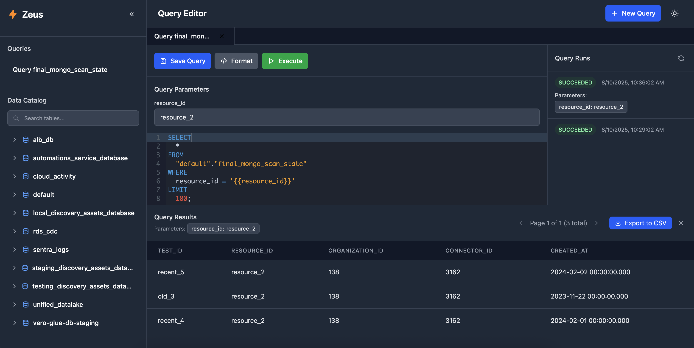

# Zeus - Athena Query Sharing Platform

<div align="center"> 
  **A modern, collaborative SQL query platform for Amazon Athena**
  
  [](https://golang.org/)
  [](https://reactjs.org/)
  [](https://www.typescriptlang.org/)
  [](https://docker.com/)

  

</div>

## 🚀 Overview

Zeus is a powerful web application that enables teams to collaboratively create, execute, and share SQL queries against Amazon Athena. Built with performance and user experience in mind, Zeus provides a modern interface for data exploration and analytics.

### ✨ Key Features

- **🔥 Query Management**: Create, save, update, and organize SQL queries with full CRUD operations
- **⚡ Real-time Execution**: Execute queries through Amazon Athena with live status updates
- **📊 Smart Results Display**: Paginated results with intelligent column sizing and CSV export
- **🏷️ Query Organization**: Rename queries inline, track execution history, and manage multiple queries
- **🌙 Dark Mode Support**: Toggle between light and dark themes for comfortable coding
- **🔍 Data Catalog Explorer**: Browse databases and tables with search functionality
- **📱 Responsive Design**: Works seamlessly across desktop and mobile devices
- **🔄 Auto-save**: Intelligent query state management with unsaved changes tracking
- **📈 Query History**: Complete execution history with status tracking and error logging

## 🏗️ Architecture

### Backend (Go)
- **Framework**: Gin web framework for high-performance HTTP routing
- **Database**: MongoDB for persistent storage of queries and execution metadata
- **Cloud Integration**: AWS SDK v1 for seamless Athena and S3 operations
- **API Design**: RESTful architecture with structured JSON responses
- **CORS Support**: Configured for cross-origin requests in development

### Frontend (React + TypeScript)
- **Framework**: React 18 with TypeScript for type-safe development
- **Styling**: Tailwind CSS 4.0 with custom design system
- **Code Editor**: ACE Editor with SQL syntax highlighting and auto-completion
- **State Management**: TanStack Query (React Query) for efficient data fetching
- **Icons**: Tabler Icons for consistent iconography
- **Build System**: Vite for fast development and optimized production builds
- **Routing**: React Router v6 with URL-based query state management

### Infrastructure
- **Containerization**: Multi-stage Docker builds for optimized deployments
- **Local Development**: LocalStack for Athena API simulation
- **Database**: MongoDB 7.0 with persistent volumes
- **Orchestration**: Docker Compose for development and production environments
- **Task Runner**: Taskfile for standardized development workflows
- **Deployment**: Kubernetes Helm charts for production deployments

## 📋 Prerequisites

### Required Software
- **Docker & Docker Compose**: For containerized development
- **Task**: Task runner for development commands ([installation guide](https://taskfile.dev/installation/))
- **AWS CLI**: For credential management and cloud integration
- **Git**: Version control

### Optional (for local development)
- **Go 1.20+**: For backend development without containers
- **Node.js 18+**: For frontend development without containers
- **MongoDB**: Local database instance
- **Air**: Go live reload tool (`go install github.com/cosmtrek/air@latest`)

## 🚀 Quick Start

### 1. Clone and Setup

```bash
# Clone the repository
git clone <your-repository-url>
cd zeus

# Install all dependencies
task setup
```

### 2. Development Environment (Recommended)

Start the complete development environment with Docker:

```bash
# Start development environment with LocalStack simulation
task dev

# Check that all services are running
task health:dev
```

This will start:
- **Frontend**: http://localhost:3001 (React development server)
- **Backend**: http://localhost:8081 (Go API server)
- **MongoDB**: localhost:27018 (Database)
- **LocalStack**: http://localhost:4567 (AWS services simulation)

### 3. Initialize LocalStack Services

```bash
# Initialize Athena and S3 services in LocalStack
task localstack:init
```

### 4. Test Query Execution

```bash
# Test with a simple query
task test:query

# Test with a table query (requires setup)
task test:query:table
```

## 🛠️ Development

### Available Development Tasks

```bash
# View all available tasks
task --list-all

# Core development tasks
task dev                 # Start full development environment
task dev:aws            # Start development with real AWS credentials
task start:backend      # Start backend with live reload
task start:frontend     # Start frontend development server
task build              # Build both frontend and backend
task clean              # Clean all build artifacts and containers
```

### Development with Real AWS

For testing against real Athena services:

```bash
# Generate AWS credentials file
task aws:env

# Start development environment with real AWS
task dev:aws

# For blocking mode (logs in foreground)
task dev:aws-blocking
```

### Local Development (Without Docker)

1. **Start dependencies**:
   ```bash
   docker-compose -f docker-compose.dev.yml up mongodb localstack -d
   task localstack:init
   ```

2. **Backend** (terminal 1):
   ```bash
   task start:backend
   ```

3. **Frontend** (terminal 2):
   ```bash
   task start:frontend
   ```

### Code Quality & Testing

```bash
# Run all tests
task test

# Linting and formatting
task lint                # Run all linters
task format             # Format all code
task lint:backend       # Go-specific linting
task lint:frontend      # Frontend linting
```

## 🏗️ How to Use Zeus

### Creating and Managing Queries

1. **New Query**: Click the "+" button or "New Query" to create a new query
2. **Write SQL**: Use the syntax-highlighted editor to write your query
3. **Save Query**: Click "Save Query" and provide a meaningful name
4. **Edit Query Names**: Hover over saved queries in sidebar and click the edit icon
5. **Multiple Queries**: Work with multiple queries using the tab interface

### Executing Queries

1. **Execute**: Click the "Execute" button to run your query
2. **Monitor Progress**: Watch real-time status updates (QUEUED → RUNNING → SUCCEEDED/FAILED)
3. **View Results**: Results appear in the bottom panel with pagination
4. **Export Data**: Click "Export to CSV" to download results
5. **Error Handling**: Failed queries show detailed error messages

### Using Parameterized Queries

Zeus supports parameterized queries using double curly brace syntax to create reusable, dynamic SQL queries:

1. **Parameter Syntax**: Use `{{parameter_name}}` in your SQL to define parameters
   ```sql
   SELECT * FROM customers 
   WHERE region = '{{region}}' 
   AND created_date > '{{start_date}}'
   ```

2. **Parameter Input**: When your query contains parameters, a parameter input panel will automatically appear below the query editor

3. **Dynamic Execution**: Fill in parameter values and execute - the same query can be run with different values without editing the SQL

4. **Parameter Persistence**: Parameter values are saved with query runs for audit trails and re-execution

**Example Use Cases**:
- Date range queries: `WHERE date BETWEEN '{{start_date}}' AND '{{end_date}}'`
- Filtering queries: `WHERE status = '{{status}}' AND priority = '{{priority}}'`
- Dynamic table names: `SELECT * FROM {{table_name}} LIMIT {{limit}}`

### Data Exploration

1. **Catalog Browser**: Use the left sidebar to explore databases and tables
2. **Quick Query**: Click on any table to generate a sample query
3. **Search Tables**: Use the search box to find specific tables
4. **Table Details**: Hover over table names to see full names

### Query Organization

- **Query History**: View all executions in the right panel
- **Status Tracking**: Monitor query status and completion times
- **Query Sharing**: Share queries by URL using the clean routing system
- **Dark Mode**: Toggle theme in the user menu

## 🚀 Deployment

### Production Deployment with Docker

```bash
# Build and start production environment
task docker:prod
```

This creates a single optimized container that:
- Builds the React frontend with Vite
- Compiles the Go backend binary
- Serves frontend assets through the Go server
- Runs on port 8080

### Docker Compose Production

```bash
# Production deployment with external MongoDB
docker-compose -f docker-compose.yml up -d
```

### Kubernetes Deployment

Zeus includes Helm charts for Kubernetes deployment:

```bash
# Navigate to helm directory
cd helm

# Install or upgrade Zeus
helm install zeus ./zeus -f values-prod.yaml

# Or use the install script
./install.sh
```

#### Helm Configuration

Key configuration options in `values.yaml`:

```yaml
# Scaling
replicaCount: 3
autoscaling:
  enabled: true
  minReplicas: 2
  maxReplicas: 10

# Resources
resources:
  limits:
    cpu: 500m
    memory: 512Mi
  requests:
    cpu: 250m
    memory: 256Mi

# Ingress
ingress:
  enabled: true
  annotations:
    kubernetes.io/ingress.class: nginx
    cert-manager.io/cluster-issuer: letsencrypt-prod
  hosts:
    - host: zeus.yourcompany.com
      paths:
        - path: /
          pathType: Prefix
  tls:
    - secretName: zeus-tls
      hosts:
        - zeus.yourcompany.com

# MongoDB
mongodb:
  enabled: true
  persistence:
    enabled: true
    size: 20Gi
```

### Environment Variables

#### Backend Configuration

```bash
# Database
MONGO_URI=mongodb://localhost:27017/zeus

# AWS Configuration
AWS_REGION=us-east-1
AWS_ACCESS_KEY_ID=your-access-key
AWS_SECRET_ACCESS_KEY=your-secret-key
AWS_SESSION_TOKEN=your-session-token  # For temporary credentials
ATHENA_RESULTS_BUCKET=your-athena-results-bucket

# Development
AWS_ENDPOINT_URL=http://localhost:4566  # For LocalStack

# Server
PORT=8080
GIN_MODE=release  # For production
```

#### Frontend Configuration

```bash
# API Endpoint
VITE_API_URL=http://localhost:8080  # Development
VITE_API_URL=https://zeus.yourcompany.com  # Production
```

## 📊 API Reference

### Query Management

```bash
# List all queries
GET /api/queries

# Create a new query
POST /api/queries
Content-Type: application/json
{
  "name": "Customer Analysis",
  "sql": "SELECT * FROM customers LIMIT 100",
  "description": "Basic customer data exploration"
}

# Get specific query
GET /api/queries/{id}

# Update query
PUT /api/queries/{id}
Content-Type: application/json
{
  "name": "Updated Customer Analysis",
  "sql": "SELECT name, email FROM customers WHERE active = true",
  "description": "Updated query for active customers only"
}

# Delete query
DELETE /api/queries/{id}
```

### Query Execution

```bash
# Execute query directly
POST /api/athena/execute
Content-Type: application/json
{
  "sql": "SELECT COUNT(*) as total_customers FROM customers"
}

# Execute parameterized query
POST /api/athena/execute
Content-Type: application/json
{
  "sql": "SELECT * FROM customers WHERE region = '{{region}}' AND status = '{{status}}'",
  "parameters": {
    "region": "us-east-1",
    "status": "active"
  }
}

# Get query results with pagination
GET /api/athena/results/{executionId}?page=1&pageSize=100

# Export results as CSV
GET /api/athena/export/{executionId}
```

### Query Run Management

```bash
# Get query execution history
GET /api/queries/{id}/runs

# Create new query run (execute saved query)
POST /api/queries/{id}/runs

# Delete query run
DELETE /api/query-runs/{id}
```

### Data Catalog

```bash
# Get Athena catalog (databases and tables)
GET /api/athena/catalog

# Health check
GET /api/health
```

## 🗄️ Data Models

### Query Model
```typescript
interface Query {
  id: string;
  name: string;
  sql: string;
  description: string;
  createdAt: string;
  updatedAt: string;
}
```

### QueryRun Model
```typescript
interface QueryRun {
  id: string;
  queryId: string;
  sql: string;
  executionId: string;
  status: 'QUEUED' | 'RUNNING' | 'SUCCEEDED' | 'FAILED' | 'CANCELLED';
  resultsS3Url?: string;
  errorMessage?: string;
  parameters?: Record<string, string>; // Parameter values used in execution
  executedAt: string;
  completedAt?: string;
}
```

### Database Models
```typescript
interface Database {
  name: string;
  tables: Table[];
}

interface Table {
  name: string;
  type: string;
}
```

## 🔧 Configuration

### AWS Setup

#### IAM Permissions
Your AWS credentials need the following permissions:

```json
{
  "Version": "2012-10-17",
  "Statement": [
    {
      "Effect": "Allow",
      "Action": [
        "athena:StartQueryExecution",
        "athena:GetQueryExecution",
        "athena:GetQueryResults",
        "athena:ListDatabases",
        "athena:ListTableMetadata",
        "glue:GetDatabases",
        "glue:GetTables"
      ],
      "Resource": "*"
    },
    {
      "Effect": "Allow",
      "Action": [
        "s3:GetObject",
        "s3:PutObject",
        "s3:DeleteObject"
      ],
      "Resource": "arn:aws:s3:::your-athena-results-bucket/*"
    },
    {
      "Effect": "Allow",
      "Action": [
        "s3:ListBucket"
      ],
      "Resource": "arn:aws:s3:::your-athena-results-bucket"
    }
  ]
}
```

#### S3 Bucket Setup
Create an S3 bucket for Athena query results:

```bash
aws s3 mb s3://your-athena-results-bucket
aws s3api put-public-access-block \
  --bucket your-athena-results-bucket \
  --public-access-block-configuration \
  BlockPublicAcls=true,IgnorePublicAcls=true,BlockPublicPolicy=true,RestrictPublicBuckets=true
```

### MongoDB Configuration

For production MongoDB setup:

```yaml
# docker-compose.yml
mongodb:
  image: mongo:7
  environment:
    MONGO_INITDB_ROOT_USERNAME: zeus_admin
    MONGO_INITDB_ROOT_PASSWORD: secure_password
    MONGO_INITDB_DATABASE: zeus
  volumes:
    - mongodb_data:/data/db
    - ./mongo-init.js:/docker-entrypoint-initdb.d/mongo-init.js:ro
```

## 🔍 Monitoring and Observability

### Health Checks

```bash
# Check all services
task health:dev

# Individual service checks
curl http://localhost:8081/api/health
curl http://localhost:4567/_localstack/health
curl http://localhost:3001
```

### Logging

View container logs:

```bash
# All services
task docker:logs

# Specific service
docker-compose -f docker-compose.dev.yml logs -f zeus-backend
docker-compose -f docker-compose.dev.yml logs -f zeus-frontend
```

### Metrics

The application provides several monitoring endpoints:

- `/api/health` - Basic health check
- Database connection status
- AWS service connectivity
- Query execution statistics

## 🐛 Troubleshooting

### Common Issues and Solutions

#### LocalStack Connection Issues
```bash
# Check if LocalStack is running
curl http://localhost:4567/_localstack/health

# Restart LocalStack
docker-compose -f docker-compose.dev.yml restart localstack

# Re-initialize services
task localstack:init
```

#### Database Connection Problems
```bash
# Check MongoDB status
docker-compose -f docker-compose.dev.yml logs mongodb

# Reset database
task db:reset

# Verify connection
nc -z localhost 27018 && echo "MongoDB is accessible"
```

#### Frontend Build Issues
```bash
# Clear dependencies and rebuild
cd frontend
rm -rf node_modules package-lock.json dist
npm install
npm run build

# Check for TypeScript errors
npm run type-check
```

#### AWS Credential Issues
```bash
# Test AWS credentials
aws sts get-caller-identity

# Regenerate credentials file
task aws:env

# Check environment variables
env | grep AWS
```

#### Query Execution Failures
1. **Check Athena permissions**: Verify IAM roles include required Athena actions
2. **S3 bucket access**: Ensure results bucket exists and is accessible
3. **SQL syntax**: Validate SQL against Athena documentation
4. **Data source**: Confirm tables exist in Glue Data Catalog

### Performance Optimization

#### Backend Optimization
- Use connection pooling for MongoDB
- Implement query result caching
- Configure appropriate timeout values
- Monitor goroutine usage

#### Frontend Optimization
- Implement virtual scrolling for large result sets
- Use React.memo for expensive components
- Optimize bundle size with code splitting
- Cache query results in localStorage

## 🤝 Contributing

We welcome contributions! Please follow these steps:

### Development Setup
1. **Fork the repository**
2. **Create feature branch**: `git checkout -b feature/amazing-feature`
3. **Setup development environment**: `task setup && task dev`
4. **Make your changes** with proper testing
5. **Run quality checks**: `task lint && task test`
6. **Submit pull request** with detailed description

### Code Standards
- **Go**: Follow Go conventions, use `gofmt`, include tests
- **TypeScript**: Use strict mode, proper typing, follow ESLint rules
- **CSS**: Use Tailwind classes, maintain design consistency
- **Git**: Write clear commit messages, use conventional commits format

### Pull Request Process
1. Update documentation for significant changes
2. Add tests for new functionality
3. Ensure all checks pass (linting, tests, builds)
4. Request review from maintainers
5. Address feedback promptly

## 📚 Additional Resources

### Documentation
- [Amazon Athena Documentation](https://docs.aws.amazon.com/athena/)
- [React Query Documentation](https://tanstack.com/query/latest)
- [Go Gin Framework](https://gin-gonic.com/)
- [Tailwind CSS](https://tailwindcss.com/)

### Tools and Extensions
- **VS Code Extensions**: Go, TypeScript, Tailwind CSS IntelliSense
- **Database Tools**: MongoDB Compass, Robo 3T
- **API Testing**: Postman, curl, httpie

## 📄 License

This project is licensed under the MIT License - see the [LICENSE](LICENSE) file for details.

---

<div align="center">
  Made with ⚡ by the Zeus team
</div>